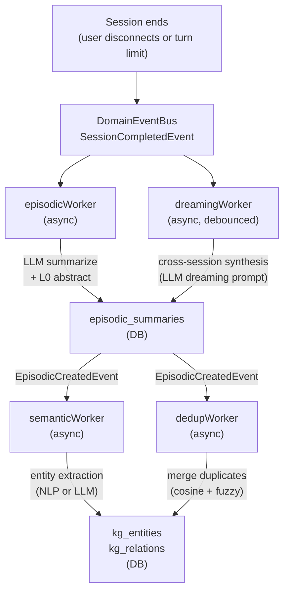

# 26 - Memory Consolidation Pipeline

The consolidation pipeline converts raw conversation data into structured long-term memory asynchronously. It runs entirely off the critical path — users see no added latency — and produces three types of memory artifacts: episodic summaries, knowledge graph entities, and synthesized insights.

---

## 1. Overview



---

## 2. Workers

### `episodicWorker`

**Trigger:** `SessionCompletedEvent`  
**Output:** One row in `episodic_summaries`

The episodic worker converts a session into a compressed narrative. It:

1. Parses `tenant_id` and `agent_id` from the event (fails fast on non-UUID values).
2. Checks idempotency via `source_id = "{session_key}:{compaction_count}"` — skips if summary already exists.
3. If the pipeline provided a compaction summary (already LLM-generated in-band), uses it directly.
4. Otherwise calls the background LLM provider (`providerresolve.ResolveBackgroundProvider`) to summarize the session messages.
5. Generates an L0 abstract (2-sentence version) via `generateL0Abstract()`.
6. Extracts entity names from the summary text.
7. Stores the result in `episodic_summaries` with a 90-day TTL.
8. Publishes `EpisodicCreatedEvent` to trigger downstream workers.

**Idempotency guarantee:** Duplicate `SessionCompletedEvent` delivery (event bus retry) is safe — the source_id check prevents double-summarization.

**Error handling:** LLM provider failures are reported via `bgalert.ReportProviderError()` (non-retryable) and the event is dropped. Transient DB errors are returned to the event bus for retry.

---

### `semanticWorker`

**Trigger:** `EpisodicCreatedEvent`  
**Output:** Rows in `kg_entities` and `kg_relations`

The semantic worker extracts structured knowledge from episodic summaries:

1. Receives `EpisodicCreatedEvent` with the summary text and agent context.
2. Calls `EntityExtractor.Extract(summary)` — an interface with two implementations:
   - **NLP extractor**: fast, no LLM call, uses named-entity recognition patterns.
   - **LLM extractor**: higher quality, uses a structured extraction prompt.
3. Stores extracted entities and relations in the knowledge graph tables.
4. Publishes `EntitiesExtractedEvent` for the dedup worker.

The `EntityExtractor` interface allows hot-swapping extraction strategies per agent config.

---

### `dedupWorker`

**Trigger:** `EntitiesExtractedEvent`  
**Output:** Merges duplicate `kg_entities` rows

Entity deduplication is needed because the same concept ("user prefers Python", "prefers Python for scripting") may be expressed differently across sessions. The dedup worker:

1. Loads newly created entities for the agent.
2. For each new entity, loads existing entities with similar names (fuzzy match + vector cosine similarity).
3. Applies the scoring function (`scoring.go`) that combines:
   - String edit distance (Levenshtein) 
   - Semantic similarity (cosine of embeddings, when available)
   - Entity type match bonus
4. Merges duplicates above the threshold: the newer entity's `metadata` is merged into the older, and the newer row is deleted.

**Lite edition:** dedup runs but without vector similarity (FTS5 string matching only).

---

### `dreamingWorker`

**Trigger:** `EpisodicCreatedEvent` (debounced) + periodic cron  
**Output:** New rows in `episodic_summaries` (type: `dream`)

The dreaming worker performs **cross-session synthesis** — it reads recent episodic summaries for an agent and asks an LLM to identify patterns, contradictions, and insights across multiple sessions.

Example dreaming prompt result:
> "Over the last 5 sessions, the user consistently asks about Python performance but avoids async patterns. They have expressed frustration with GIL limitations twice. Consider pro-actively suggesting multiprocessing in future sessions."

#### Configuration

Dreaming behavior is configurable per agent via `config.DreamingConfig` in the agent's metadata:

```json
{
  "dreaming": {
    "enabled": true,
    "debounce_ms": 5000,
    "threshold": 3,
    "verbose_log": false
  }
}
```

| Field | Default | Meaning |
|-------|---------|---------|
| `enabled` | `true` | Enable/disable dreaming for this agent |
| `debounce_ms` | `5000` | Wait this long after the last episodic event before triggering |
| `threshold` | `3` | Minimum new episodic summaries before dreaming fires |
| `verbose_log` | `false` | Log full dreaming prompt/response to slog |

**Lite edition:** Dreaming is disabled (KG is excluded from Lite; dreaming uses the same background LLM call path but produces episodic-type summaries).

---

## 3. Event Bus Integration

All workers register via `consolidation.Register(deps)` at gateway startup:

```go
cleanup := consolidation.Register(consolidation.ConsolidationDeps{
    EpisodicStore: store.EpisodicStore,
    MemoryStore:   store.MemoryStore,
    KGStore:       store.KnowledgeGraphStore,
    SessionStore:  store.SessionCoreStore,
    EventBus:      eventBus,
    SystemConfigs: store.SystemConfigStore,
    Registry:      providers.Registry,
    Extractor:     consolidation.DefaultEntityExtractor,
    AlertDeps:     bgalert.Deps,
    AgentStore:    store.AgentCRUDStore, // optional; nil = use defaults
})
defer cleanup()
```

`cleanup()` unsubscribes all handlers — important for graceful shutdown.

### Event Types

| Event | Publisher | Consumer(s) |
|-------|-----------|-------------|
| `session.completed` | Agent loop (post-turn memory flush) | `episodicWorker`, `dreamingWorker` |
| `episodic.created` | `episodicWorker` | `semanticWorker`, `dedupWorker` |
| `entities.extracted` | `semanticWorker` | `dedupWorker` |

Events carry `TenantID`, `AgentID` (UUID string), `UserID`, and a typed `Payload`.

---

## 4. Memory Retrieval

Consolidated memory is read back in three ways:

### L0 Auto-Injection

Recent episodic summaries (last N sessions, N configured per agent) are automatically prepended to the system prompt by the context stage. Uses `L0Abstract` — the 2-sentence version — to minimize token cost.

```go
// internal/pipeline/context_stage.go
summaries := store.EpisodicStore.ListRecent(ctx, agentID, userID, limit)
for _, s := range summaries {
    systemPrompt += fmt.Sprintf("[Memory] %s\n", s.L0Abstract)
}
```

### L1 On-Demand Recall (Tool)

The `recall_memory` tool fetches episodic summaries matching a time range or topic:

```
User: "What did we discuss last week about the deployment?"
→ recall_memory(agent_id, time_range="last_week", query="deployment")
→ Returns top-N episodic summaries ranked by relevance
```

### L2 Semantic Search (Tool)

The `search_memory` tool queries the knowledge graph and vector store:

```
→ search_memory(agent_id, query="user's Python preferences")
→ Hybrid search: BM25 on entity names + cosine similarity on embeddings
→ Returns kg_entities + related summaries
```

---

## 5. TTL and Pruning

| Table | TTL | Pruning trigger |
|-------|-----|----------------|
| `episodic_summaries` | 90 days (default) | Cron job or background worker |
| `kg_entities` | None (permanent) | Manual or agent-level `forget` tool |
| `kg_relations` | None (permanent) | Cascade from entity delete |
| Dream summaries | 30 days | Same cron as episodic |

Per-agent TTL override: set `memory_config.episodic_ttl_days` in agent settings.

---

## 6. Observability

All workers log at `slog.Debug` level by default. Key log fields:

| Field | Meaning |
|-------|---------|
| `agent` | `agent_key` string (human-readable) |
| `session` | Session key |
| `source_id` | Idempotency key (`session_key:compaction_count`) |
| `summary_len` | Character length of generated summary |
| `entities_extracted` | Count of entities extracted |
| `dedup_merged` | Count of entity merges performed |

Background LLM errors are reported via `bgalert.ReportProviderError()` — surfaced as alerts in the dashboard without disrupting the user session.
