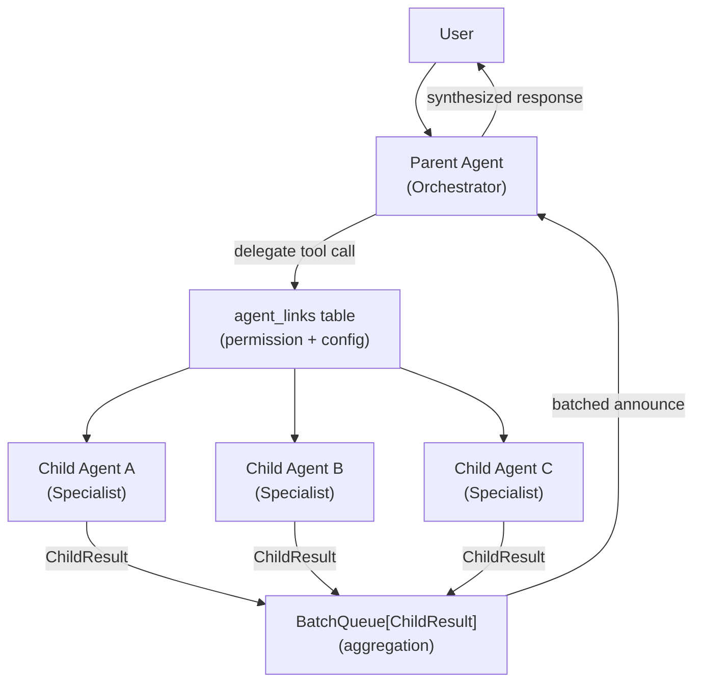

# 27 - Orchestration and Delegation

This document covers GoClaw's inter-agent orchestration primitives: the `delegate` tool, `agent_links` configuration, the `BatchQueue[T]` generic, the `ChildResult` abstraction, and how multi-agent work is distributed and aggregated.

For team-specific orchestration (task board, mailbox), see [11-agent-teams.md](./11-agent-teams.md).

---

## 1. Overview

GoClaw enables **multi-agent collaboration** where a parent agent delegates sub-tasks to specialized child agents. The result is a distributed agent system where work is token-aware, depth-bounded, and reported back in structured form.



---

## 2. Agent Links

Agent links (`agent_links` table) define the **permission boundary** for delegation. An agent can only delegate to another agent if a link exists between them.

### Link Schema

| Field | Type | Description |
|-------|------|-------------|
| `source_agent_id` | `uuid` | The agent that sends work |
| `target_agent_id` | `uuid` | The agent that receives work |
| `direction` | `outbound` | Always `outbound` (source → target) |
| `max_concurrent` | `int` | Max simultaneous delegations on this link |
| `team_id` | `uuid?` | If set, link was created by team auto-wiring |
| `enabled` | `bool` | Toggle without deleting |
| `metadata` | `jsonb` | Optional: timeout, priority, tags |

### Link Creation

Links are created in two ways:

1. **Manual** — admin creates a link via HTTP API or WS config method.
2. **Auto-wired by team setup** — when a team is created, links from lead → each member are created automatically with `team_id` set and `max_concurrent: 3`.

---

## 3. The `delegate` Tool

The `delegate` tool is how agents invoke other agents. It is registered in the tool registry and available to any agent with `delegate` in their allow list.

### Parameters

```json
{
  "name": "delegate",
  "parameters": {
    "target_agent": "string (agent_key of the target)",
    "task": "string (natural language task description)",
    "context": "string (optional: additional context to pass)",
    "timeout_seconds": "int (optional: max wait time, default from link config)",
    "sync": "bool (optional: true = wait for result, false = fire-and-forget)"
  }
}
```

### Execution Flow

```
1. Resolve target_agent (agent_key → UUID) via agent router
2. Check agent_links: source → target link must exist + enabled
3. Acquire link concurrency slot (max_concurrent semaphore)
4. Spawn child session for target agent in SubagentLane
5. If sync=true: wait for ChildResult (or timeout)
6. If sync=false: return immediately, result delivered via announce queue
7. Release concurrency slot
```

### Result Format (Sync Mode)

```json
{
  "status": "completed",
  "content": "The task output from the child agent...",
  "input_tokens": 1240,
  "output_tokens": 320,
  "runtime_ms": 4200,
  "iterations": 3
}
```

### Async Mode and Announce Queue

In async mode (`sync=false`), child results are delivered to the parent via the **announce queue** (`internal/subagent/`). This is a serialized producer-consumer queue that:

1. Buffers results from multiple concurrent children.
2. Delivers them to the parent as a single batched message once all queued results arrive.
3. Prevents the parent's message stream from being flooded by individual child completions.

---

## 4. `BatchQueue[T]` — Generic Result Aggregator

`BatchQueue[T]` (`internal/orchestration/batch_queue.go`) is a generic concurrency primitive used by the announce queue and team task aggregation.

### Pattern

```
Multiple producers enqueue entries concurrently.
The FIRST enqueue caller becomes the "processor".
The processor drains all queued entries and processes them as a batch.
If more entries arrive while processing, TryFinish returns false → process again.
Terminates when TryFinish returns true (queue empty).
```

### API

```go
type BatchQueue[T any] struct { /* ... */ }

// Enqueue adds an entry. Returns isProcessor=true if caller must run the drain loop.
func (bq *BatchQueue[T]) Enqueue(key string, entry T) bool

// Drain takes all pending entries atomically.
func (bq *BatchQueue[T]) Drain(key string) []T

// TryFinish checks for pending entries and marks queue idle if empty.
// Returns true if the processing loop should exit.
func (bq *BatchQueue[T]) TryFinish(key string) bool
```

### Usage in Announce Queue

```go
var queue orchestration.BatchQueue[ChildResult]

// Each child agent goroutine:
isProcessor := queue.Enqueue(parentSessionKey, result)
if isProcessor {
    for {
        batch := queue.Drain(parentSessionKey)
        sendToParent(parentSessionKey, batch)
        if queue.TryFinish(parentSessionKey) {
            break
        }
    }
}
```

This design ensures exactly one goroutine sends to the parent, eliminating races without a dedicated worker goroutine.

---

## 5. `ChildResult` — Unified Result Abstraction

`ChildResult` (`internal/orchestration/child_result.go`) captures the outcome of any child agent run, regardless of whether it used the v2 (`agent.RunResult`) or v3 (`pipeline.RunResult`) execution path.

```go
type ChildResult struct {
    Content      string
    Media        []bus.MediaFile
    InputTokens  int64
    OutputTokens int64
    Runtime      time.Duration
    Iterations   int
    Status       string // "completed", "failed", "cancelled"
}
```

Two capture functions handle the translation:

```go
// From v2 agent loop:
result := orchestration.CaptureFromRunResult(runResult, elapsed)

// From v3 pipeline:
result := orchestration.CaptureFromPipelineResult(pipelineResult, elapsed)
```

The orchestration layer consumes `ChildResult` uniformly, regardless of which execution path produced it.

---

## 6. Depth and Concurrency Bounds

Delegation is bounded to prevent runaway agent trees.

| Limit | Standard | Lite | Config Key |
|-------|----------|------|-----------|
| Max subagent depth | Config (default 3) | 1 | `gateway.max_subagent_depth` |
| Max subagent concurrent | Config | 2 | `gateway.max_subagent_concurrent` |
| Per-link max concurrent | Per link config | same | `agent_links.max_concurrent` |

Depth is tracked in context:

```go
ctx = scheduler.WithDepth(ctx, parentDepth+1)
```

At max depth, the child agent runs with a restricted tool set (no `spawn`, no `delegate`) — the "leaf" deny list prevents further recursion.

---

## 7. Token-Aware Distribution

When a parent agent distributes work to multiple children, it should be token-aware to avoid overspending. Best practices injected via `TEAM.md`:

1. **Decompose** the task into parallel sub-tasks, one per child.
2. **Estimate** token budget per sub-task relative to total budget.
3. **Monitor** child results for token usage; adjust remaining sub-tasks accordingly.
4. **Synthesize** — aggregate `ChildResult.Content` fields into a unified response.

The `BatchQueue` delivers all child results together, enabling a single synthesis LLM call rather than N sequential syntheses.

---

## 8. Delegation vs Subagent Spawn

Two overlapping but distinct concepts:

| Aspect | `delegate` tool | `spawn` / subagent |
|--------|----------------|-------------------|
| Target | Named agent (by key) | New ephemeral agent instance |
| Permission | Requires `agent_links` | Inherits parent's session scope |
| Identity | Separate agent (own system prompt) | Inline sub-run of parent config |
| Use case | Specialized expert agents | Parallel workload distribution |
| Team integration | Used by team lead → member | Used within a single agent's context |
| Result delivery | Announce queue (async) or sync wait | Direct RunResult |

For team orchestration, `delegate` is the primary mechanism. For in-agent parallelism, `spawn` is used.

---

## 9. Media Aggregation

When child agents produce media files (images, audio, PDFs), `ChildResult.Media` carries the file paths. The parent's announce handler collects all media from the batch and:

1. Checks `DeliveredMedia` set (prevents duplicate delivery).
2. Sends each new file to the channel (Telegram, Discord, etc.) using the `send_file` tool semantics.
3. Marks files as delivered in `DeliveredMedia`.

This ensures media produced by parallel children reaches the user once and only once.

---

## 10. Observability

| Log Field | Meaning |
|-----------|---------|
| `"delegate"` | Target `agent_key` |
| `"depth"` | Current delegation depth |
| `"link_id"` | UUID of the agent_link used |
| `"sync"` | Whether the call was sync or async |
| `"child_status"` | `"completed"` / `"failed"` / `"cancelled"` |
| `"input_tokens"` | Tokens consumed by child |
| `"output_tokens"` | Tokens produced by child |
| `"runtime_ms"` | Wall time for child execution |

Security logs (`slog.Warn("security.*")`) fire when:
- A delegation attempt fails the link permission check.
- A child exceeds the depth limit.
- A link's `max_concurrent` is hit.
